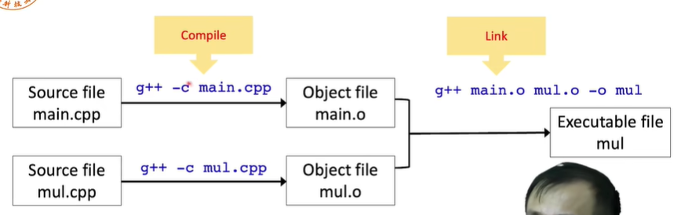
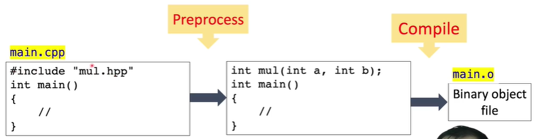
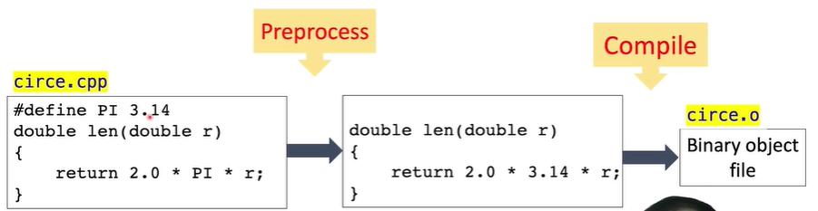
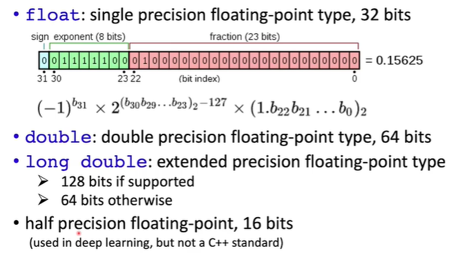
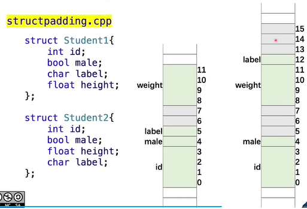
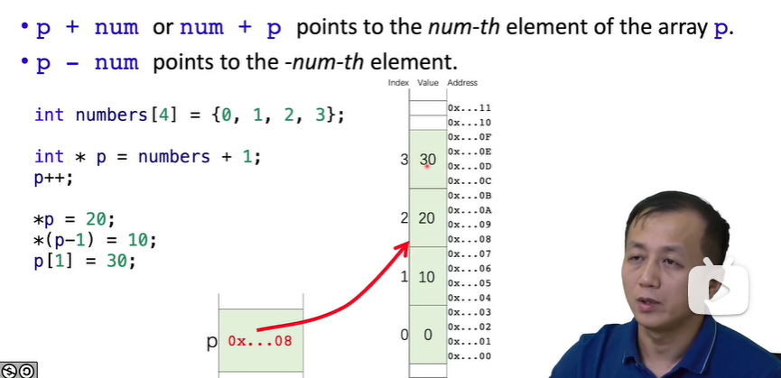
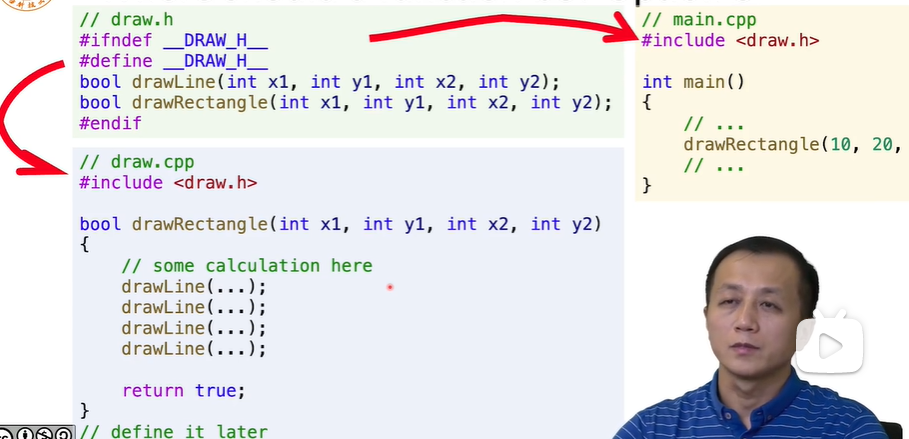
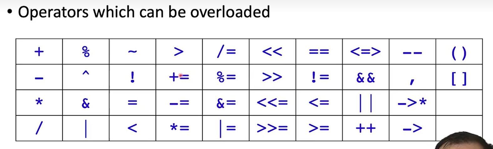
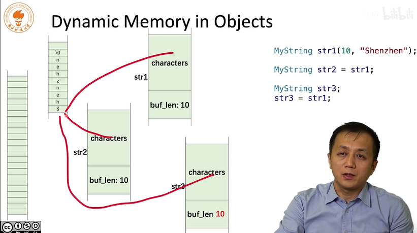

# cmake

## 在配置c++编译环境的时候需要安装gcc包，可能会出现安装不成功的情况

解决方案：

```
https://blog.csdn.net/beizhengren/article/details/77678603?ops_request_misc=%257B%2522request%255Fid%2522%253A%2522166704007516800182721209%2522%252C%2522scm%2522%253A%252220140713.130102334..%2522%257D&request_id=166704007516800182721209&biz_id=0&utm_medium=distribute.pc_search_result.none-task-blog-2~all~top_positive~default-1-77678603-null-null.142^v62^opensearch_v2,201^v3^control_2,213^v1^t3_control2&utm_term=%E6%97%A0%E6%B3%95%E5%AE%9A%E4%BD%8D%E8%BD%AF%E4%BB%B6%E5%8C%85&spm=1018.2226.3001.4187

操作source.list文件，在文件末尾添加
deb https://mirrors.tuna.tsinghua.edu.cn/ubuntu/ bionic main restricted universe multiverse
# deb-src https://mirrors.tuna.tsinghua.edu.cn/ubuntu/ bionic main restricted universe multiverse
deb https://mirrors.tuna.tsinghua.edu.cn/ubuntu/ bionic-updates main restricted universe multiverse
# deb-src https://mirrors.tuna.tsinghua.edu.cn/ubuntu/ bionic-updates main restricted universe multiverse
deb https://mirrors.tuna.tsinghua.edu.cn/ubuntu/ bionic-backports main restricted universe multiverse
# deb-src https://mirrors.tuna.tsinghua.edu.cn/ubuntu/ bionic-backports main restricted universe multiverse
deb https://mirrors.tuna.tsinghua.edu.cn/ubuntu/ bionic-security main restricted universe multiverse
# deb-src https://mirrors.tuna.tsinghua.edu.cn/ubuntu/ bionic-security main restricted universe multiverse


然后执行
sudo apt-get update
```

## xshell连接不上linux可能的问题

```
可能是linux系统下没有安装ssh


#查看ssh服务安装情况
rpm -qa | grep ssh 
#未安装使用命令安装
sudo apt install ssh

即可解决
```

## 需要安装的包

```
gcc cmake g++
```

## 编译cmake

```
cmake .		进行编译，为了生成Makefile文件
make		最终使用Makefile文件进行编译

cmake .. 表示编译上一级目录
```

```
编译每一个文件夹下面的文件都需要有一个CMakeLists.txt文件
```

```
删除CMakeLists.txt文件里面的所有内容
echo "" > CMakeList.txt
```

```
如果想重新生成main，输入make clean就可以删除main这个elf文件。
```

```
project (hello)

set(SRC_LIST main.cpp ./testFun.cpp)

```

## cmake中的关键字

### 1. 同一目录下的多个源文件

#### aux_source_directory

```
使用aux_source_directory把当前目录下的源文件列表存放到SRC_LIST里，然后在add_executable里调用SRC_LIST

cmake_minimum_required (VERSION 2.8)
project (demo)
aux_source_directory(. SRC_LIST)
add_executable(main ${SRC_LIST})

```

#### set

```
但是aux_source_directory也存在弊端，他会把指定目录下的所有源文件都加进来，可能会加入一些我们不需要的文件，此时我们可以使用set命令去新建变量来存放需要的源文件

cmake_minimum_required (VERSION 2.8)
project (demo)
set( SRC_LIST
	 ./main.c
	 ./testFunc1.c
	 ./testFunc.c)
add_executable(main ${SRC_LIST})

```

### 2. 不同目录下的多个源文件

#### include_directories

```
文件结构如下：
CMakeList.txt
main.c
test_func
	testFunc.c
	testFunc.h
test_func1
	testFunc1.c
	testFunc2.h
```

```
cmake_minimum_required (VERSION 2.8)
project (demo)

include_directories (test_func test_func1)

aux_source_directory (test_func SRC_LIST)
aux_source_directory (test_func1 SRC_LIST1)

add_executable (main main.c ${SRC_LIST} ${SRC_LIST1})

```

这里出现了一个新的命令：**include_directories**。该命令是用来向工程添加多个指定头文件的搜索路径，路径之间用空格分隔。
因为main.c里include了testFunc.h和testFunc1.h，如果没有这个命令来指定头文件所在位置，就会无法编译。当然，也可以在main.c里使用include来指定路径，如下

```c++
#include "test_func/testFunc.h"
#include "test_func1/testFunc1.h"
```


## cmake中的正规组织结构

```
bin：存放最终输出的elf文件
build：存放生成的对象文件
include：存放头文件(.h)
src：存放源文件(.c)
```

在最外层目录下新建一个CMakeLists.txt，内容如下：

```
cmake_minimum_required (VERSION 2.8)

project (demo)

add_subdirectory (src)

```

这里出现一个新的命令add_subdirectory()，这个命令可以向当前工程添加存放源文件的子目录，并可以指定中间二进制和目标二进制的存放位置，具体用法可以百度。

这里制定了src目录下存放了源文件，当执行cmake时，就会进入src目录下去找src目录下的CMakeLists.txt，所以在src目录下也建立了一个CMakeLists.txt，内容如下：

```
aux_source_directory (. SRC_LIST)

include_directories (../include)

add_executable (main ${SRC_LIST})

set (EXECUTABLE_OUTPUT_PATH ${PROJECT_SOURCE_DIR}/bin)

```

这里又出现了一个新的命令set，是用于定义变量的，EXECUTABLE_OUT_PATH和PROJECT_SOURCE_DIR是CMake自带的预定义变量，其意义如下：

- EXECUTABLE_OUT_PATH：目标二进制可执行文件的存放位置
- PROJECT_SOURCE_DIR：工程的根目录

所以，这里set的意思是把存放elf文件的位置设置为工程根目录下的bin目录。

下面来运行cmake，不过得在build目录下，然后输入以下命令：

```sh
cmake ..
```

Makefile会在build目录下生成，然后在build目录下运行make

*解释一下为什么在build目录下运行cmake。*

<u>如果不这样做，cmake运行时生成的附带文件就会跟源码文件混在一起，这样会对程序的目录结构造成污染，而在build目录下运行cmake，生成的附带文件就只会待在build目录下，如果我们不想要这些文件了就可以直接清空build目录，非常方便。</u>

另外一种写法：

前面的工程使用了2个CMakeLists.txt文件，最外层的CMakeLists.txt用于掌控全局，使用add_subdirectory来控制其他目录下的CMakeLists.txt的运行。

也可以只用一个CMakeLists.txt，把最外层的CMakeLists.txt内容改写成下面的内容同时把src目录下面的CMakeLists.txt删除：

```
cmake_minimum_required (VERSION 2.8)

project (demo)

set (EXECUTABLE_OUTPUT_PATH ${PROJECT_SOURCE_DIR}/bin)

aux_source_directory (src SRC_LIST)

include_directories (include)

add_executable (main ${SRC_LIST})

```

```
上面的文件结构：
bin
build
CMakeLists.txt
include
	testFunc1.h
	testFunc.h
src
	main.c
	testFunc1.c
	testFunc.c
	CMakeLists.txt(删)
```

## 动态库和静态库的编译控制

```
文件结构：
build
CMakeLists.txt
lib
testFunc
	testFunc.c
	testFunc.h
```

```
cmake_minimum_required (VERSION 3.5)

project (demo)

set (SRC_LIST ${PROJECT_SOURCE_DIR}/testFunc/testFunc.c)

add_library (testFunc_shared SHARED ${SRC_LIST})
add_library (testFunc_static STATIC ${SRC_LIST})

set_target_properties (testFunc_shared PROPERTIES OUTPUT_NAME "testFunc")
set_target_properties (testFunc_static PROPERTIES OUTPUT_NAME "testFunc")

set (LIBRARY_OUTPUT_PATH ${PROJECT_SOURCE_DIR}/lib)
```

add_library：生成动态库或静态库(第1个参数指定库的名字；第2个参数决定是动态还是静态，如果没有就默认静态；第3个参数指定生成库的源文件)
set_target_properties：设置最终生成的库的名称，还有其它功能，如设置库的版本号等等
LIBRARY_OUTPUT_PATH：库文件的默认输出路径，这里设置为工程目录下的lib目录

前面使用set_target_properties重新定义了库的输出名称，如果不使用set_target_properties也可以，那么库的名称就是add_library里定义的名称，只是连续2次使用add_library指定库名称时（第一个参数），这个名称不能相同，而set_target_properties可以把名称设置为相同，只是最终生成的库文件后缀不同（一个是.so，一个是.a），这样相对来说会好看点。

## 关键字

- find_library: 在指定目录下查找指定库，并把**库的绝对路径**存放到变量里，其第一个参数是变量名称，第二个参数是库名称，第三个参数是HINTS，第4个参数是路径，其它用法可以参考cmake文档
- target_link_libraries: 把目标文件与库文件进行链接


## 添加编译选项

```
cmake_minimum_required (VERSION 2.8)

project (demo)

set (EXECUTABLE_OUTPUT_PATH ${PROJECT_SOURCE_DIR}/bin)

add_compile_options(-std=c++11 -Wall) 

add_executable(main main.cpp)
```

## 添加控制选项

```
cmake_minimum_required(VERSION 3.5)

project(demo)

option(MYDEBUG "enable debug compilation" OFF)

set (EXECUTABLE_OUTPUT_PATH ${PROJECT_SOURCE_DIR}/bin)

add_subdirectory(src)
```

option命令，其第一个参数是这个option的名字，第二个参数是字符串，用来描述这个option是来干嘛的，第三个是option的值，ON或OFF，也可以不写，不写就是默认OFF。

```
cmake_minimum_required (VERSION 3.5)

add_executable(main1 main1.c)

if (MYDEBUG)
    add_executable(main2 main2.c)
else()
    message(STATUS "Currently is not in debug mode")    
endif()

```


常见c++厂商

| 厂商 | C     | C++     | Fortran  |
| ---- | ----- | ------- | -------- |
| GNU  | gcc   | g++     | gfortran |
| LLVM | clang | clang++ | flang    |

```
g++ main.cpp -o a.out
g++ main.cpp --std=c++11 -o a.out
```

# cpp

```
函数的声明一般放到头文件中：*.h、*.hpp
函数的实现一般放到源文件中：*.c、*.cpp
```

## 1.1. 编译和链接

```c++
main.cpp

#include<iostream>
#include "mul.hpp"

using namespace std;

int main()
{
	int a,b;
	int result;
	
	cout << "Pick two integers:";
	cin >> a;
	cin >> b;
	
	result = mul(a,b);
	
	cout << "The result is " << result << endl;
	
	return 0;
}
```

```
mul.hpp

#pragma once（这是一个预处理指令）表示我这个头文件只能被include一次，不能重复include

int mul(int a,int b);
```

```
#include "mul.hpp"
int mul(int a,int b)
{
	return a * b;
}
```



```
编译和链接过程如下：
main.cpp通过g++把它编译成main.o，.o文件为object的文件 是一个二进制文件
-c的意思是：只编译不链接
从object的文件生成可执行程序的步骤叫链接，实际上就是把两个二进制文件合并起来
```

常见三类错误：编译错误、链接错误、运行时错误

## 1.2. Preprocessor（预处理）

每个预处理指令占一行，而且只能占一行，如果预处理指令特别长，可以使用转义符转成一行

```
preprocessing instruction:
define,undef,include,if,ifdef,ifndef,else,elif,endif,line,error,pragma
```





## 1.3. argc和argv参数

```
#include<iostream>
using namespace std;
int main(int argc,char **argv)
{
	for(int i = 0 ;i<argc;i++){
		cout << i << ":" << argv[i] << endl;
	}
}
```

argc表示有几个参数，argv就是参数列表

## 2.1数值初始化方式

```
int num;
num = 10;

int num = 10;

int num (10);

int num {10};
```

unsigned int 和 int 的区别

```
signed int 最高位为符号位，0表示整数，1表示负数。取值范围为：[-2^31,2^31-1]
unsigned int 无符号位。取值范围为：[0,2^32-1]
```

查看在C/C++中每种数据类型占多少位：https://en.cppreference.com/w/cpp/language/types

```
查看数据类型占多少字节
sizeof(int)
```


```
since C++11 定义数据的方式
#include<cstdint>
int8_t
int16_t
int32_t
int64_t
uint8_t
uint16_t
uint32_t
uint64_t


具体区别可以看以下链接
https://blog.csdn.net/yz930618/article/details/84785970?ops_request_misc=%257B%2522request%255Fid%2522%253A%2522166797844316782390514060%2522%252C%2522scm%2522%253A%252220140713.130102334..%2522%257D&request_id=166797844316782390514060&biz_id=0&utm_medium=distribute.pc_search_result.none-task-blog-2~all~baidu_landing_v2~default-1-84785970-null-null.142^v63^opensearch_v2,201^v3^control_2,213^v2^t3_control1&utm_term=int8_t%E3%80%81int16_t&spm=1018.2226.3001.4187
```

```
some useful macros 查看最大数和最小数
#include<cstdint>
INT8_MIN
INT16_MIN
INT32_MIN
INT64_MIN
INT8_MAX
INT16_MAX
INT32_MAX
INT64_MAX
```




```
float f1 = 2.34E+10f;
float f2 = f1 + 10;
此时f2==f1，因为浮点数是间隔采样的，不能连续的表示一个数值，所以需要达到下一个采样点的界限才能真正的增长

所以我们如果我们要比较两个浮点数的大小的话，最好用
if(f1 == f2)//bad
if(fabs(f1-f2) < FLT_EPSILON)//good
```

## 2.2 算数运算

### 常数数值定义

```
95		//decimal
0137	//octal
0x5F	//hexadecimal

95		//int
95u		//unsigned int
95l		//long
95ul	//unsigned long
95lu	//unsigned long

3.14159	//3.14159
6.02e23	//6.02*10^23
1.6e-19	//1.6*10^-19
3.0		//3.0

6.02e23L	//long double
6.02e23f	//float
6.02e23		//double
```

### const type qualifier

```
const float PI = 3.1415926f;
必须在定义的时候进行初始化；不能修改
```

### arithmetic operators

| Operator name       | Syntax |
| ------------------- | ------ |
| bitwise NOT         | ~a     |
| bitwise AND         | a & b  |
| bitwise OR          | a \| b |
| bitwise XOR         | a ^ b  |
| bitwise left shift  | a << b |
| bitwise right shift | a >> b |

## 3.1 分支语句

```
factor = isPositive ? 1 : -1;
factor = (isPOsitive) * 2 - 1;
建议使用下面的用法，因为下面没有使用跳转语句，效率更加高效
```

## 4.1 string

```
string定义方式：
char name1[] = "ABCD";
const wchar_t[] s = L"ABCD";
const char16_t[] s = u"ABCD";	//since c++11
const char32_t[] s = U"ABCD";	//since c++11
```

```
Copy:
	char* strcpy(char* dest, const char* src);//存在长度溢出的情况
	char* strncpy(char *dest, const char *src, size_t count);//count表示最多复制多少个字符，可以设置为min(dest,src)

Concatenate:appends a copy of src to dest
	char *strcat(char *dest, const char *src);
	char *strncat(char *dest, const char *src, size_t count);
	
Compare:
	int strcmp(const char *lhs, const char *rhs);
```

使用string class

```
string class provides functions to manipulate and examinate strings.
std::string str1 = "Hello";
std::string str2 = "SUSTech";
std::string result = str1 + "," + str2;
```

```
different types of strings
std::string
std::wstring
std::u8string	//(C++20)
std::u16string	//(C++11)
std::u32string	//(C++11)
```

## 4.2 structures-unions-enumerations

计算机为了存储的方便，它存储变量都是对齐的，在读写的时候效率更高

如下图所示，左面的占12个字节，右面的占16个字节




```c++
struct Student{
	int id;
	bool male;
	char label;
	float height;
}
Student stu;
stu.id = 123;

No typedef needed in C++!
```


union

```
union ipv4address{
	std::uint32_t address32;
	std::uint8_t address8[4];
}
sizeof(union ipv4address) is 4;

结构体中的所有成员共享同一个内存，也就是说上面中，那两个成员变量的首地址相同。如果他有多个成员变量，那么以最大的成员变量为准，就是整个union的大小。

```

enum

```
enum color {WHITE,BLACK,RED,GREEN,BLUE,YELLOW,NUM_COLORS};
enum color pen_color = RED;

```

```c++
enum datatype {TYPE_INT8=1,TYPE_INT16=2,TYPE_INT32=4,TYPE_INT64=8}
struct Point{
	enum datatype type;
	union {
		std::int8_t data8[3];
		std::int16_t data16[3];
		std::int32_t data32[3];
		std::int64_t data64[3];
	};
};
size_t datawidth(struct Point pt)
{
	return size_t(pt.type) * 3;
}

int64_t l2norm(struct Point pt)
{
	int64_t result = 0;
	switch(pt.type)
	{
		case (TYPE_INT8):
			result = abs(pt.data8[0])+
					abs(pt.data8[1])+
					abs(pt.data8[2]);
			break;
			....
	}
}
```

```
struct Point point1 = {.type=TYPE_INT8, .data8={-2,3,4}};
```

typedef

```
typedef unsigned char vec3b[3];

unsigned char color[3];
vec3b color = {255,0,255};
```


## 5.1 pointer

```c++
结构体的指针：
struct Student
{
	char name[4];
	int born;
	bool male;
};
Student stu = {"Yu", 2000, true};
Student *pStu = &stu;

p->member;
(*p).member;
```

```c++
Student students[128];
Student * p0 = &students[0];

// the same behavier
students[0].born = 2000;
p0->born = 2000;
```


## 5.2 Constant pointers

```c++
int num = 1;
int another = 2;
//You cannot change the value the p1 points to through p1
const int * p1 = &num;
*p1 = 2;//error
num = 3;//okay

//You cannot change value of p2 (address)
int * const p2 = &num;
*p2 = 3;//okay
p2 = &another;//error

//You cannot change either of them
const int * const p3 = &num;
```

用处

```c++
//当我在一个函数里传入变量的时候，我不希望在函数中去修改这个变量就可以加const
int foo(const char * p)
{
	//the value that p points to cannot be changed
	
	//play a trick?
	char * p2 = p;//syntax error
	//...
	
	return 0;
}
```

## 5.3 pointer-array

```
&students
students
&students[0]
这三个的值是相同的，都是数组的首地址

Students * p = students;
p[0].born = 2001;
可以以这种方式修改值
```


在进行p+1的操作的时候，并不是把p偏移1个字节，而是偏移int个字节，这里的int代表的就是指针的类型int * p



```
下面这些是等价的
int i = ...;
int * p = ...;

p[i] = 3;

*(p+i) = 3;

int * p2 = p+i; *p2 = 3;
```

可以把数组和指针很相似，但是数组是constant指针，只能指向那块内存 不能随便乱指，指针可以随便乱指。

区别2就是sizeof的不同，数组的sizeof值为所有值所占的内存，指针的sizeof为存储地址所占的内存

```
int numbers[4] = {0,1,2,3};
int *p = numbers;
cout << sizeof(numbers) << endl;//4*sizeof(int)
cout << sizeof(p) << endl;//4 or 8
cout << sizeof(double *) << endl;//4 or 8
```

## 5.4 allocate memory C

申请内存使用malloc（）

```
int *p = (int *)malloc(4);
理论上来说是申请了4字节的空间，但是系统会分配16字节的空间，是因为要进行对齐，剩余的12字节就算是浪费了
```

释放内存

```
void free(void* ptr);


p = (int *) malloc (sizeof(int));
free(p)
```

```;
浪费情况1：
p = (int *) malloc (sizeof(int)*4);
//...
p = (int *) malloc (sizeof(int)*8);
//...
free(p);
此时释放的内存为第二次申请的内存，第一次申请的内存由于没有被释放且没有指针了，所以也没有办法找到他了
```

```
浪费情况2：
void foo()
{
	int *p = (int *) malloc (sizeof(int));
	return;
}
p为函数的局部变量，当return之后，p就消失了，作用域就到此为止了，这段内存也无法回收了，造成了内存泄漏
```

## 5.5 allocate memory C++

申请内存使用new、new[]

```c++
//allocate an int, default initializer (do nothing)
int *p1 = new int;
//allocate an int, initialized to 0
int *p2 = new int();
//allocate an int, initialized to 5
int *p3 = new int(5);
//allocate an int, initialized to 0
int *p4 = new int{};//C++11
//allocate an int, initialized to 5
int *p5 = new int{5};//C++11

//allocate a Student object, default initializer
Student *ps1 = new Student;
//allocate a Student object, initialize the memebers
Student *ps2 = new Student{"Yu", 2020, 1};
```

```c++
//allocate 16 int, default initializer(do nothing)
int *pa1 = new int[16];
//allocate 16 int, zero initialized
int *pa2 = new int[16]();
//allocate 16 int, zero initialized
int *pa3 = new int[16]{};//C++11
//allocate 16 int, the first 3 element are initialized to 1,2,3, the rest 0
int *pa4 = new int[16]{1,2,3};//C++11

Student *psa1 = new Student[16];

Student *psa2 = new Student[16]{{"li",2000,1},{"Yu",2001,1}}
```

释放内存

```c++
//deallocate memory
delete p1;
//deallocate memory
delete ps1;

//deallocate the memory of the array
delete pa1;
//deallocate the memory of the array
delete []pa2;

//deallocate the memory of the array, and call the destructor of the first element
delete psa1;
//deallocate the memory of the array, and call the destructors of all the elements
delete []psa2;
```

**建议在释放数组的时候就统一使用 delete []psa2这种**


## 6.1 function

头文件的知识



```
#ifndef _DRAW_H_：这里ifdef是一个宏定义，后面的是名字，可以任意指定
在这里应用
#ifndef
#define
...
#endif
这种格式是为了防止重复定义函数
```

```
实参和形参的问题：在6.2节里面讲了
我的理解是：只要碰到一个定义变量的符号就可以认为在内存中找了一块空间来copy存储了另外一份变量，与原来的变量值相同 但是地址不同
```

## 6.2 references：引用

```
可以理解为：为变量起一个别名
int num = 0;
int &num_ref = num;
此时num_ref就可以当作num来看待了，他们在内存中指向的是同一块地址
相当于一个起别名的操作
```

```
需要注意的地方就是：在定义引用的时候就要初始化
int &num_ref;//error
```

```
引用相较于指针来说更加安全
```

```
为了防止在函数中修改引用的变量，可以加const修饰
float matrix_max(const struct Matrix & mat)
```

## 6.3 inline function

```
宏定义虽然灵活但是易于出错，所以在C++中不太鼓励使用宏

#define MAX_MACRO(a,b) (a) > (b) ? (a) : (b)
```

```
inline函数：
在程序中调用函数的话是会有部分内存消耗的，比如会在调用函数之前存储当前的状态，因此如果我们的函数过于简单并且频繁调用的话，还不如不调用；因此，inline函数产生了：
inline float max(float a,float b){}
使用inline的话，会建议编译器使用inline的方式来编译函数，但是也只是个建议，编译器可能不会执行。编译器会根据函数的复杂度来选择，根据整体的情况来选择
```

## 7.1 default arguments

```
argument和parameter的区别：虽然都是参数的意思
float norm(float x, float y, float z = 0);
在这里:0是argument，z是parameter
```

```
float norm(float x, float y, float z)
float norm(float x, float y, float z = 0)
float norm(float x, float y = 0, float z)
在定义默认参数的时候要从尾部开始默认定义，而且可以理解为默认参数是可以叠加的，比如上边第二行定义的z=0，它同样在第三个函数起作用 第三个函数也默认z为0
```


## 7.2 function templates

```
int sum(int a,int b)
{
	cout << "int:" << a+b << endl;
}

float sum(float a,float b)
{
	cout << "float:" << a+b << endl;
}

double sum(double a,double b)
{
	cout << "double:" << a+b << endl;
}

此时的函数重载部分是相似的，如果一处改动需要改动其他的
```

```c++
template<typename T>
T sum(T x,T y)
{
	cout << "The input type is " << typeid(T).name() << endl;
	return x + y;
}
//instantiates sum<double>(double, double)
template double sum<double>(double, double);

//instantiates sum<char>(char, char), template argument deduced
template double sum<>(char, char);

//instantiates sum<int>(int, int), template argument deduced
template int sum(int, int);
上面是显式的实例化，还可以进行隐式的实例化

模板只是一个虚拟的概念，编译器一定要生成一个实实在在的函数，所以一定要实例化。
```

```c++
隐式实例化的例子
template<typename T>
T product(T x,T y)
{
	cout << "The input type is " << typeid(T).name() << endl;
	return x + y;
}
//Implicitly instantiates product<int>(int, int)
cout << "product = " << product<int>(2.2f, 3.0f) << endl;
//上面因为我已经制定了int型的实现，所以即使我输入的是浮点数也会调用int型实现，下面根据2.2f判断为是浮点数，所以会调用float型实现
//Implicitly instantiates productt<float>(float, float)
cout << "product = " << product(2.2f, 3.0f) << endl;
```

```c++
//实例化不需要函数体和<>，特例化都需要
template<>
Point sum<Point>(Point pt1, Point pt2)
{
	cout << "The input type is " << typeid(pt1).name() << endl;
	Point pt;
	pt.x = pt1.x + pt2.x;
	pt.y = pt1.y + pt2.y;
	return pt;
}
```

## 7.3 function pointer(用的不是很多)

```
函数指针是一个指针，指向一个函数，原来的指针是指向数据

float norm_l1(float x, float y);
float norm_l2(float x, float y);
float (*norm_ptr)(float x, float y);

norm_ptr = norm_l1;//Pointer norm_ptr is pointing to norm_l1
norm_ptr = &norm_l2;//Pointer norm_ptr is pointing to norm_l2

//如何用指针调用函数
float len1 = norm_ptr(-3.0f, 4.0f);//function invoked
float len2 = (*norm_ptr)(-3.0f, 4.0f);//function invoked
```

```
函数指针的另外一个用处就是：把函数指针作为一个参数传入另外一个函数中
比如在对结构体数组进行排序时，需要指定要按什么标准进行排序

void qsort(void *ptr,size_t count, size_t size, int (*comp)(const void *, const void *));
```

```c++
//函数引用的例子
#include<iostream>
#include<cmath>

using namespace std;

float norm_l1(float x, float y);//declaration
float norm_l2(float x, float y);//declaration
float (&norm_ref)(float x, float y);//norm_ref is a function reference

int main()
{
	cout << "L1 norm of (-3,4) = " << norm_ref(-3, 4) <<endl;
	return 0;
}

float norm_l1(float x, float y)
{
	return fabs(x) + fabs(y);
}
```


## 8.1 seedup program

在视频8.2节中讲了怎么加速程序计算

整个第八节都是讲怎么优化程序的，如何让程序计算的更快


## 9.1 class

```c++
//此部分代码主要帮助理解“::”的作用，目前理解来看，::前面的是一个类，后面的就是一个方法名
class Student
{
	private:
		char name[4];
		int born;
		bool male;
	public:	
		void setName(const char *s){
			strncpy(name, s, sizeof(name));
		}
		void setBorn(int b){
			born = b;
		}
		void setGender(bool isMale);
		void printInfo();
};
inline void Student::setGender(bool isMale)
{
	male = isMale;
}
void Student::printInfo()
{
	cout << "Name: " << name << endl;
	cout << "Born in " << born << endl;
	cout << "Gender: " << (male ? "Male" : "Female") << endl;
}
```


```
使用#include<student.hpp>和使用#include"student.hpp"的区别：
使用<>时编译器从编译器指定的include路径来去找这些头文件
使用""除了从编译器指定目录寻找还从当前目录寻找(当前目录是指当前cpp文件的目录)
```

## 9.2 constructors and destructors(构造函数和析构函数)

```
申请空间->调用构造函数
构造函数必须和类名相同并且没有返回值
```

```c++
class Student
{
	private:
		//...
	public:
		Student(){
			name[0] = 0;
			born = 0;
			male = false;
		}
		Student(const char * initName, int initBorn, bool isMale){
			setName(initName);
			born = initBorn;
			male = isMale;
		}
		//上面的也可以写成下面的这种形式
		Student(const char * initName):born(0),male(true)
		{
			setName(initName);
		}
}
```

```c++
//类的初始化方式
Student hh;

Student li("LI");
li.printInfo();

Student xue = Student("ZHOU",2000,true);
xue.printInfo();

Student *zhou = new Student("zhou",2001,true);
zhou->printInfo();
delete zhou;
```

```
析构函数不能重载，只能有一个
常用于释放内存、关闭文件、断掉网络等等
定义方式为：~类名
```

```
上文中Student *zhou = new Student("zhou",2001,true);
这里是动态申请来的，不会调用析构函数，需要自己delete

比如在上面的代码中如果我将name定义为：
name = new char[1024];

那么我需要在析构函数中写如下内容：
~Student()
{
	delete []name;
}
```

```
注意点：
只要new的时候是个数组，那么delete的时候就要加[]
```

## 9.3 this

```
void setBorn(int born)
{
	this->born = born;
}
```

## 9.4 const and static members

```
#define VALUE 100

const int value = 100;
const int * p_int;//这个和下面这个是一样的，指针指向的内容不能透过指针去修改
int const * p_int;

int * const p_int;//指针指向的内容可以修改，但是我指针这个地址不能修改，指针一定指到那个位置

void func(const int *);
void func(const int &);
```

```
class Student
{
	private:
		const int BMI = 24;
		//...
	public:
		int getBorn() const//这里需要注意const不能放到int前面，因为如果放到前面就相当于返回一个const int类型的值了
		//用const修饰的成员函数，不能修改成员变量
		{
			born++;//不可以，原因如上
			return born;
		}
}
```

static

```
static members are not bound to class instances
静态成员变量和成员函数是不绑定在某个示例（对象）上的，不管你有几个对象，我的静态成员只有1个，即使你没有对象，我也有我的静态成员

在类内只进行声明，在类外进行定义
```

```c++
class Student
{
	private:
		static size_t student_total;//declaration only
    	//inline static size_t student_total = 0;//C++17,definition outside isn't needed
	public:
		Student()
		{
			student_total++;
		}
		~Student()
		{
			student_total--;
		}
		static size_t getTotal() {return student_total;}
}
//definition it here
size_t Student::student_total = 0;

//静态成员函数可以通过以下方式调用
Student::getTotal()//说明不管有几个对象，该函数都是存在的
```

## 10.1 operator overloading

```c++
class MyTime
{
	private:
		int hours;
		int minutes;
	public:
		MyTime():hours(0),minutes(0){}
		MyTime(int h, int m): hours(h), minutes(m){}
		
		MyTime operator+(const MyTime & t) const
		{
			MyTime sum;
			sum.minutes = this->minutes + t.minutes;
			sum.hours = this->hours + t.hours;
			
			sum.hours += sum.minutes / 60;
			sum.minutes %= 60;
			
			return sum;
		}
		
		MyTime operator+(int m) const
		{
			MyTime sum;
			sum.minutes = this->minutes + m;
			sum.hours = this->hours;
			sum.hours += sum.minutes / 60;
			sum.minutes %= 60;
			return sum;
		}
		
		MyTime operator+(const std::string str) const
		{
			MyTime sum = *this;
			if(str=="one hour")
				sum.hours = this->hours + 1;
			else
				std::cerr << "Only \"one hour\" is supported." << std::endl;
			return sum;
		}
};
```

## 10.2 friend functions(友元函数)

```
友元函数即这个函数是朋友，它可以访问该类的所有成员变量 包含私有成员
友元函数不是类的成员函数

并且一个友元函数可以在不同的类中进行定义
```


```
在上面的例子中，mytime+20可以运行，而20+mytime却不能运行，所以提出了友元函数


Friend functions:
	1.Declare in a class body
	2.Granted class access to members(including private members)
	3.But not members
```

写法：

```
写法1：
class MyTime
{
	// ...
	pulic:
		friend MyTime operator+(int m, const MyTime & t)
		{
			return t + m;
		}
}

写法2：
class MyTime
{
	// ...
	pulic:
		friend MyTime operator+(int m, const MyTime & t)
};
MyTime operator+(int m, const MyTime & t)
{
	return t + m;
}
```

<<运算符重载

```
But in (cout << t1;), the first operand is std::ostream, not MyTime.
To modify the definition of std::ostream?No！
Use a friend function

friend std::ostream & operator<<(std::ostream & os, const MyTime & t)
{
	std::string str = std::to_string(t.hours)+" hours and "+std::to_string(t.minutes)+" minutes.";
	os << str;
	return os;
}
friend std::istream & operator>>(std::istream & is, MyTime & t)
{
	is >> t.hours >> t.minutes;
	t.hours += t.minutes / 60;
	t.minutes %= 60;
	return is;
}
```

operator type()

```
//implicit conversion
operator int() const
{
	return this->hours * 60 + this->minutes;
}
//explicit conversion:加了explicit表示 不可以进行隐式的类型转换，必须进行显式的类型转换
explicit operator float() const
{
	return float(this->hours * 60 + this->minutes);
}

MyTime t1(1, 20);
int minutes = t1;
float f = float(t1);//如果进行浮点型转换必须加float，这里是和上面explicit对应的
```


```
MyTime & operator=(int m)
{
	this->hours = 0;
	this->minutes = m;
	this->hours = this->minutes / 60;
	this->minutes %= 60;
	return *this;
}


MyTime t = 70;这种情况执行构造函数
MyTime t;
t = 80;这种情况执行重载的函数，进行赋值
```

自增和自减运算符重载

```
//prefix increment ++放在前面,++i
MyTime& operator++()
{
	this->minutes++;
	this->hours += this->minutes / 60;
	this->minutes = this->minutes % 60;
	return *this;
}
//postfix increment ++放在后面,i++
MyTime operator++(int)
{
	MyTime old = *this;//keep the old value
	operator++();//prefix increment
	return old;
}
```

可以进行重载的运算符




## 11.1 default constructors

```
copy constructors:拷贝构造函数
MyTime::MyTime(MyTime & t){...}
调用拷贝构造函数的一般形式为：
	类名 对象2(对象1);
	类名 对象2 = 对象1;

copy assignment:赋值操作
MyTime & MyTime::operator=(MyTime & ){...}


MyTime t1(1, 59);
MyTime t2 = t1;//copy constructor
t2 = t1;//copy assignment
```

## 11.2 an example

```
class MyString
{
	int buf_len;
	char * characters;
	public:
		MyString(int buf_len = 64, const char * data = NULL)
		{
			this->buf_len = 0;
			this->characters = NULL;
			create(buf_len, data);
		}
		~MyString()
		{
			delete []this->characters;
		}
		....
		bool create(int buf_len, const char * data)
		{
			this->buf_len = buf_len;
			
			if(this->buf_len != 0)
			{
				this->characters = new char(this->buf_len){};
				if(data)
					strncpy(this->characters, data, this->buf_len);
			}
			
			return true;
		}
}
```



```
存在的问题：1.存在内存重复释放问题，比如我在str1里已经将内存进行释放了，我在str2里又释放了，所以会出现问题。2.存在内存泄漏问题，在初始化str3的时候申请的内存没有被释放

```

## 11.3 hard copy（上面问题的解决方式）浅拷贝与深拷贝

```
C++提供的默认的copy constructor出了问题，把指针直接进行了赋值，所以要实现自定义的拷贝构造函数。
解决方法：让所有的对象都有一块自己的内存，不再去分享数据

MyString::MyString(const MyString & ms)
{
	this->buf_len = 0;
	this->characters = NULL;
	create(ms.buf_len, ms.characters);
}
create()函数会先释放内存然后再重新申请一块内存
保证了this->characters将不会指向ms.characters
```

```
在赋值运算符的时候有问题，默认的运算符重载进行了进行了两个变量的赋值
MyString & operator=(const MyString &ms)
{
	create(ms.buf_len, ms.characters);
	return *this;
}
```

```
bool create(int buf_len, const char * data)
{
	release();
	
	this->buf_len = buf_len;
	
	if(this->buf_len != 0){
		this->characters = new char(this->buf_len){};
	}
	if(data)
		strncpy(this->characters, data, this->buf_len);
		
	return true;
}
bool release()//如果我有内存那我就把他释放掉
{
	this->buf_len = 0;
	if(this->characters!=NULL){
		delete []this->characters;
		this->characters = NULL;
	}
	return 0;
}
```

## 11.4 smart pointers(智能指针)

使用智能指针可以只管申请内存，不用管释放内存

```
std::shared_ptr：这个指针可以多个指针指向同一个对象
第一种：采用构造函数方式创建
std::shared_ptr<MyTime> mt1(new MyTime(10));
std::shared_ptr<MyTime> mt2 = mt1;

第二种：采用make_shared函数创建，后面的(1,70)是MyTime的构造函数的参数
auto mt1 = std::make_shared<MyTime>(1, 70);
上面的auto == std::shared_ptr<MyTime>

std::shared_ptr<MyTime> mt0 = new MyTime(0, 70);
MyTime * mt1 = std::make_shared<MyTime>(1, 70);
上面这两种都是错误的，智能指针和普通的指针不能相互赋值
```

```
std::unique_ptr：这个指针不允许其他指针指向它，只能有一个指针指向它
std::unique_ptr<MyTime> mt1(new MyTime(10));
std::unique_ptr<MyTime> mt2 = std::make_unique<MyTime>(80);//C++17

std::unique_ptr<MyTime> mt3 = std::move(mt1);//如果让指针指向对象的话需要用move
```


## 12.1 虚函数

能够用到虚函数的场景有：类A继承类B，两个类均实现了某一个函数，我在定义指针的时候，定义方式为：B *p = new A();如果不用虚函数那么就是调用B的函数，如果用虚函数那么就会进行动态绑定，调用A里的函数。

虚函数的作用主要是进行动态绑定，动态绑定和静态绑定的区别如下：

- Static binding: the compiler decides which function to call.
- Dynamic binding: the called function is decided at runtime.

纯虚函数没有具体的实现，类似于Java中的接口的方法的定义

析构函数一定是虚函数


## 13.1 template

"Function templates" vs "template functions"函数模板和模板函数的区别

```c++
//这个是函数模板
template<typename T>
T sum(T x, T y)
{
	cout << "The input type is " << typeid(T).name() << endl;
	return x + y;
}
```

```c++
//这个是模板函数
template double sum<double>(double, double);
template char sum<>(char, char);
template int sum(int, int);
```

类模板

```c++
template<typename T>
class Mat
{
	size_t rows;
	size_t cols;
	T * data;
	
	public:
		Mat(size_t rows, size_t cols):rows(rows), cols(cols)
		{
			data = new T[rows * cols * sizeof(T)]{};
		}
		~Mat()
		{
			delete []data;
		}
		T getElement(size_t r, size_t c);
		bool setElement(size_t r, size_t c, T value);
}

template class Mat<int>;
```

**13.2节值得反复看一下**


类模板的特例化

```
template<>
class Mat<int>
{
	...
}
表示当T为int时，要进行特例化处理
```


## 14.1 stream

less管道的操作

```
./program | less
./program > output.log
./program 1> output.log
./program >> output.log
./program > /dev/null
```

```
./program 2> error.log
./program > output.log 2> error.log
./program &> all.log
./program > all.log 2>&1
```


## 15.1 exception

```
扔出不同的异常 会有不同的部分接住它

float ratio(float a, float b)
{
	if(a<0)
		throw 1;
	if(b<0)
		throw 2;
	if(fabs(a+b)<FLT_EPSILON)
		throw "Error ....";
	
	return (a-b)/(a+b);
}

try{
	z = ratio(x,y);
}catch(const char * msg){
	...
}catch(int eid){
	...
}catch(...){//这里的...表示上面的异常都不属于，类似于default
	
}
```

```
void foo() noexcept;//这个noexcept说明这个函数不会抛出异常
```

```
nothrow
第一种：
tyr{
	p = new int[length];
}catch(std::bad_alloc & ba){//如果申请空间不足，会抛出异常
	cerr << ba.what() << endl;
}
第二种：
//not throw an exception此时代码不会抛出异常，如果申请空间不足，p=null
p = new(nothrow) int[length];
if(p==NULL){
	...
}
```


# 目前还未搞懂的地方

int8_t、int16_t的意思:见下方链接

https://blog.csdn.net/y2385750851/article/details/120594021?ops_request_misc=&request_id=&biz_id=102&utm_term=int64_t&utm_medium=distribute.pc_search_result.none-task-blog-2~all~sobaiduweb~default-5-120594021.nonecase&spm=1018.2226.3001.4187

size_t：表示一个很大的整数？解答：size_t相当于无符号的int，表示的数都为非负数

char *指向字符串的理解

函数返回值里包含&引用，怎么理解

引用的理解

# 杂

```
宏是不可以换行的

#define .......
可以使用 \ 进行换行
例子：
#define PRINT_ARRAY(array, n) \
for(int idx = 0;idx < (n);idx++) \
	cout << "array[" << idx << "] = " << (array)[idx] << endl;
	
上面(a)加括号的意义就是防止传入一些运算符之类的东西，影响运算级
记住在宏里面参数都加括号就行了
```

```
fprintf("%s,%d",__FILE__,__LINE__);这样就会输出对应的文件名和行数
__FUNCTION__会输出对应函数
```

# 自己在编写代码中遇到的一些小总结

1.当定义一个类的成员变量的字符串为char *时，在构造函数中进行初始化时需要注意，不能直接this->name = name;目前是这样理解的，name为一个指针，它一定是一个字符串的地址，所以需要用new

```c++
class student{
private:
    int id;
    int score;
    char *name;
public:
    student(int number):id(number){}
    student(int id,int score,char *name){
        this->id = id;
        this->score = score;
        this->name = new char [strlen(name)+1];
        strcpy(this->name, name);
    }
};
```

2.当一个类的成员变量包含指针的时候，如果只是简单地使用拷贝构造函数是不可以的，因为此时会出现两个指针指向同一块地址，然后在释放内存时重复释放的问题

```c++
Student::Student(const Student& stu)
{
    name = new char[strlen(stu.name) + 1];
    if (name != 0) {
        strcpy(name, stu.name);
        score = stu.score;
    }
}

```

3.如果想要禁止默认的拷贝构造和拷贝赋值函数，该怎么办

```
类名为A
A(const A&) = delete;
A& operator=(const A&) = delete;
```

4.当一个函数的返回值为引用的时候，可以支持连等号
